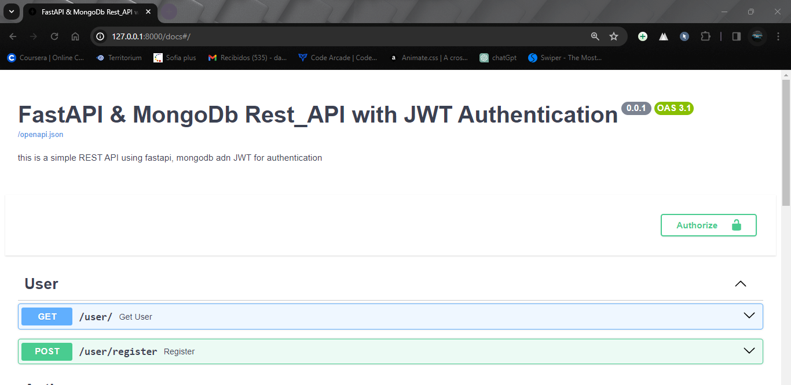
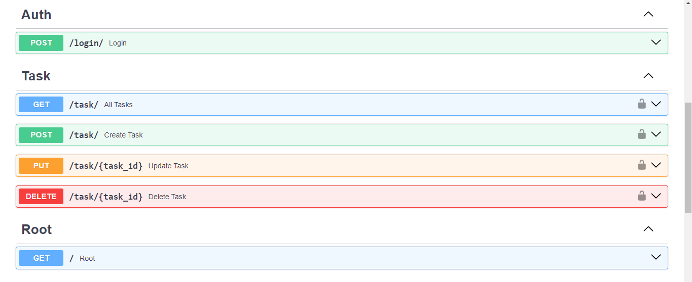
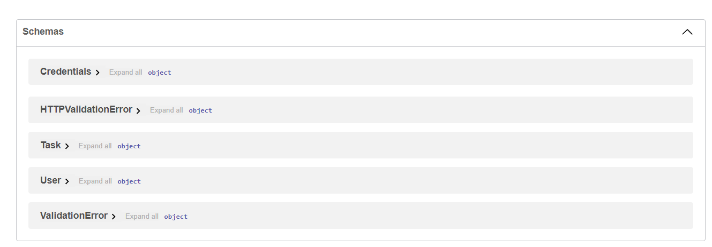

# FastAPI & MongoDb Rest_API with JWT Authentication


This repository contains a simple REST API developed using FastAPI, MongoDB, and JWT for authentication.







## Intalation

1. Clona el repositorio:
    ```
    git clone https://github.com/usuario/proyecto.git
    ```
2. Instala las dependencias:
    ```
    pip install -r requirements.txt
    ```

## Use

To start the server, run:

uvicorn app.main:app --reload

create and .env file with the next variables:
MONGO_DB_URI = "mongodb+srv://<username>:<password>.@cluster0.70zx4ii.mongodb.net/"
SECRET_KEY= "9bZn8kq8bdas53d65as46a1d2s1da54das5d4as8das21asdZ2p"
ALGORITHM = "HS256"


## Tests

To execute the tests, use:

pytest tests/test_name.py

Run the tests in this order:

1 test_user.py
2 test_auth.py
3 test_task.py


## Documentation
 once you run uvicorn app.main:app --reload
 go to  http://127.0.0.1:8000/docs#/

## License

Información sobre la licencia.


